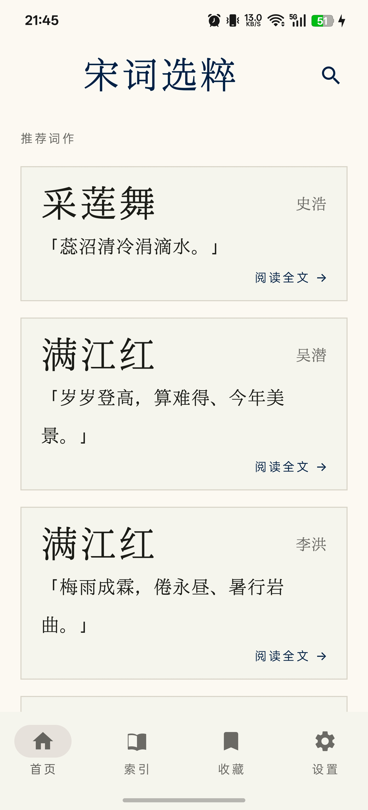
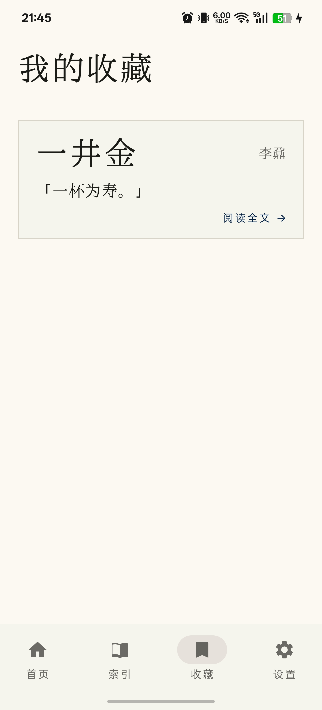
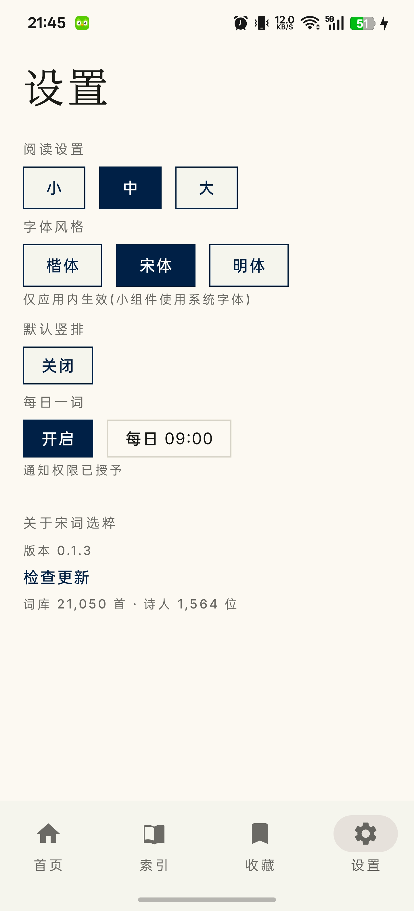
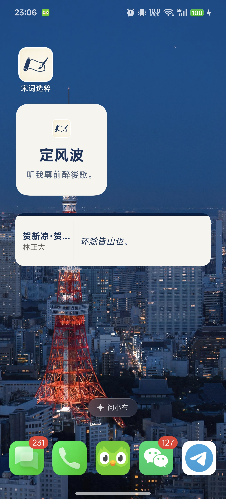
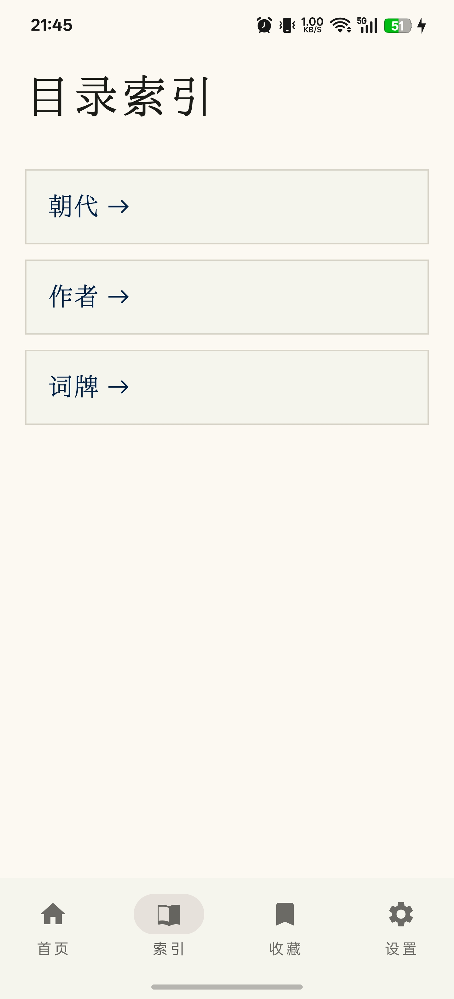
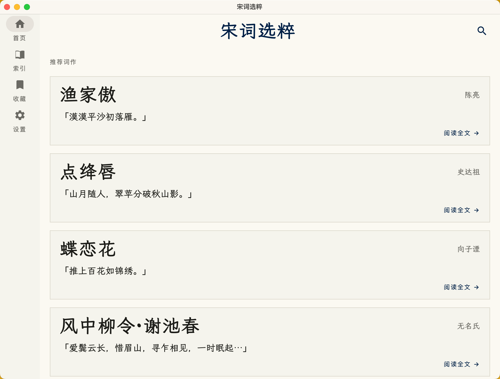
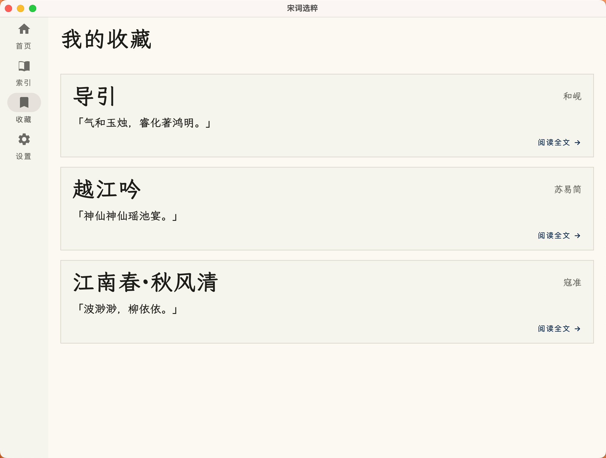
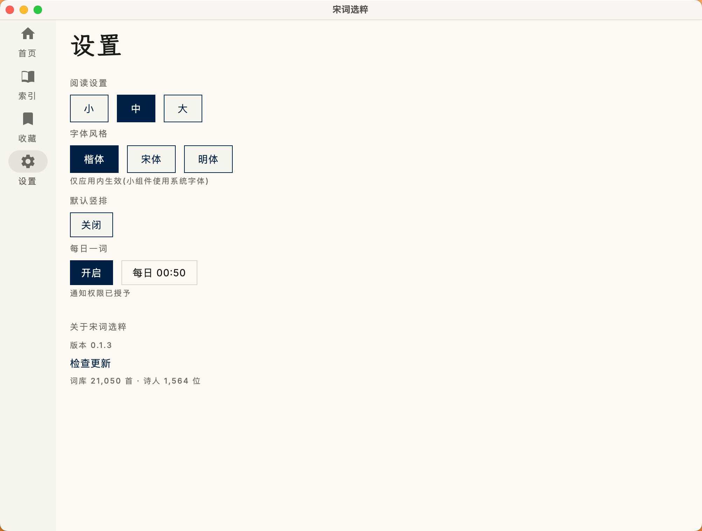
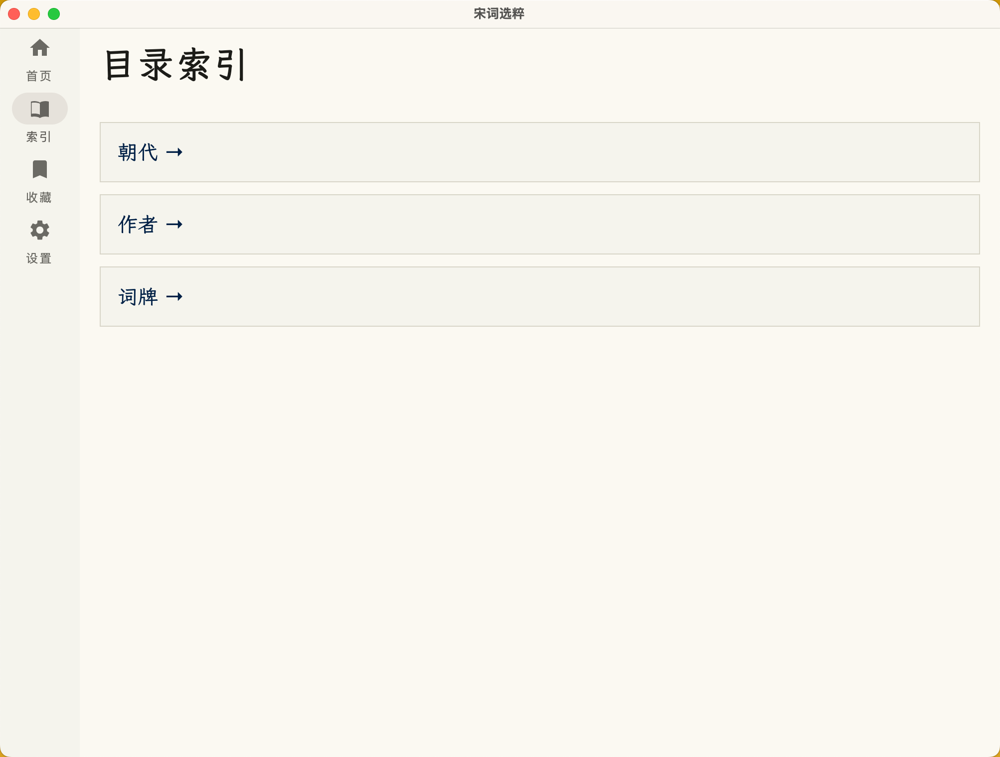

# 宋词选粹 · Songci Selection

高保真数字手稿风格的宋词鉴赏应用与数据仓库。21,340 首词作(Kotlin Multiplatform 三端应用 + Python 数据管线 + 钦定词谱格律体系 + 三端小组件与每日一词通知)。

## 仓库导航

| 路径 | 内容 |
|---|---|
| [app/](app/README.md) | Compose Multiplatform 应用:技术栈、构建、关键决策、数据治理记录 |
| [PRD.md](PRD.md) | 产品需求文档(Classical Manuscript 设计哲学、核心功能) |
| [DESIGN.md](DESIGN.md) | 「Classical Manuscript」设计系统 token 定义 |
| [design/](design/README.md) | UI 视觉设计资产(屏幕设计、应用图标、小组件 4 尺寸) |
| [data/](data/) | 源数据(ci.json 21,340 首 / ciauthor.json 名录 / 生成清单) |
| [db/](db/) | 数据管线(db/build.py:源数据 → SQLite) |
| [scripts/](scripts/) | 部署与工具脚本(macos-widget-deploy.sh 一步部署、字体子集化) |
| [screen/](screen/) | 应用截图宣传素材(phone 手机 / tablet 平板,含各功能页) |
| [licenses/](licenses/) | 字体等第三方许可文件 |
| [.trellis/](.trellis/) | Trellis 开发工作流(任务、spec 规范、journal) |

## 项目状态(2026-08-21)

**应用能力**
- 三端(Android/iOS/macOS)+ 自适应(768dp 宽屏双栏)/ 搜索 / 收藏 / 字号与字体风格持久化 / 三端图标
- 导航:首页(每日推荐池) + 索引(作者/词牌/朝代三级) + 收藏 + 设置 四 Tab,宽屏主从布局,最近浏览记录
- 词作详情:上下阕分段(格律段边界,74.9% 精确)+ 格律卡片(多体切换 2,306 体、异名显示、韵脚下划线)
- **小组件**:Android 2x2/4x1(Glance,楷体、随机过滤、午夜刷新、深链;4x2/4x4 UI 调整中暂屏蔽)+ macOS WidgetKit 扩展(Small/Medium),`scripts/macos-widget-deploy.sh` 一步打包/签名/部署
- **每日一词通知**:三端定时推送(词牌·作者+首句,点击深链)——Android WorkManager / iOS 滚动窗口 / macOS 常驻回调,设置页自研翻页钟风格时间选择器

**数据体系**
- 词库 21,340 首(含金元词人补全 290 首);格律映射 84.2% 词牌 / 95.4% 词作
- 词牌异名关联(565 别名 + 3 策展)与异名搜索展开
- ⿰ 缺失:词牌名层清零,内容层 3,035 处(最低优先级,忠实显示)

**开发规范**
- .trellis/spec 已填充项目真实约定(数据管线/UI 模式/零新依赖原则)
- 全部工作经 Trellis 任务驱动(33 项归档),trellis-check 质量闭环

## 应用截图

> 截图位于 [screen/](screen/)(phone 手机 / tablet 平板),为应用实机渲染宣传素材。

### 手机(phone)

竖屏 1440×3168,单列展示。

| 首页 | 详情 | 详情·格律 | 搜索 |
|---|---|---|---|
|  |  |  |  |

| 作者列表 | 作者详情 | 词牌词作 | 收藏 |
|---|---|---|---|
|  |  |  |  |

| 索引·词牌 | 索引·朝代 | 设置 |
|---|---|---|
|  |  |  |

### 平板(tablet)

横屏 2006×1520,宽屏自适应双栏布局。

| 首页双栏 | 详情 | 详情·格律 | 搜索 |
|---|---|---|---|
|  |  |  |  |

| 作者列表 | 作者详情 | 词牌词作 | 收藏 |
|---|---|---|---|
|  |  |  |  |

| 索引·词牌 | 设置 |
|---|---|
|  |  |

## 快速开始

```bash
# 应用构建(详见 app/README.md)
cd app && ./gradlew :composeApp:desktopTest :composeApp:packageDmg

# 数据重建(源数据变更后)
python3 db/build.py && python3 app/data/tools/prepare_db.py

# macOS 一键部署(compose 打包 + 小组件 extension + 签名 + 装 /Applications)
./scripts/macos-widget-deploy.sh
```

> 网络注意:本机官方源不可达,gradle wrapper 指向腾讯镜像;外部数据源(chinese_word_rhyme/poetry-source)按 data/tools 脚本提示 clone 到本机路径。
